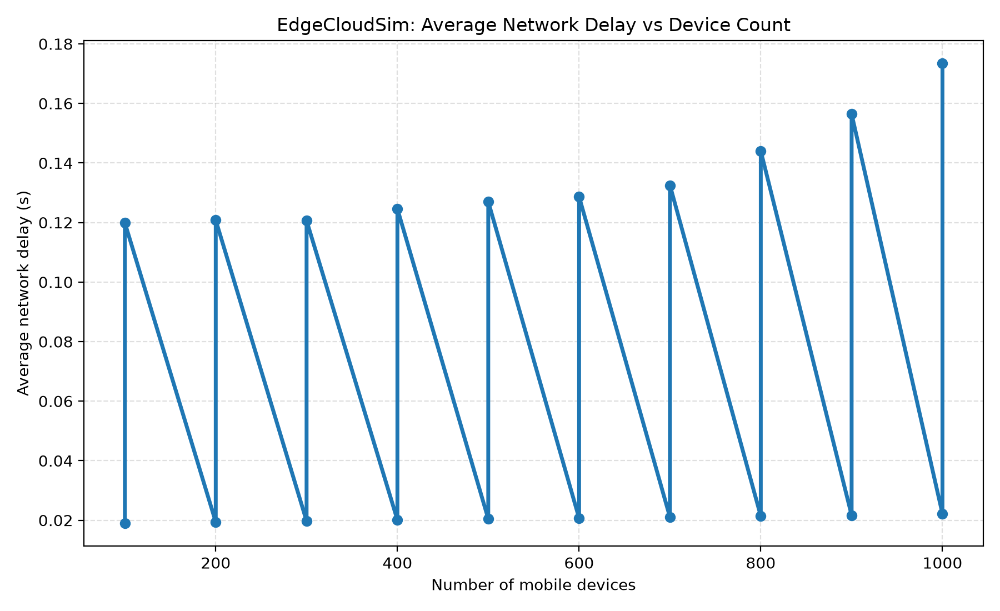
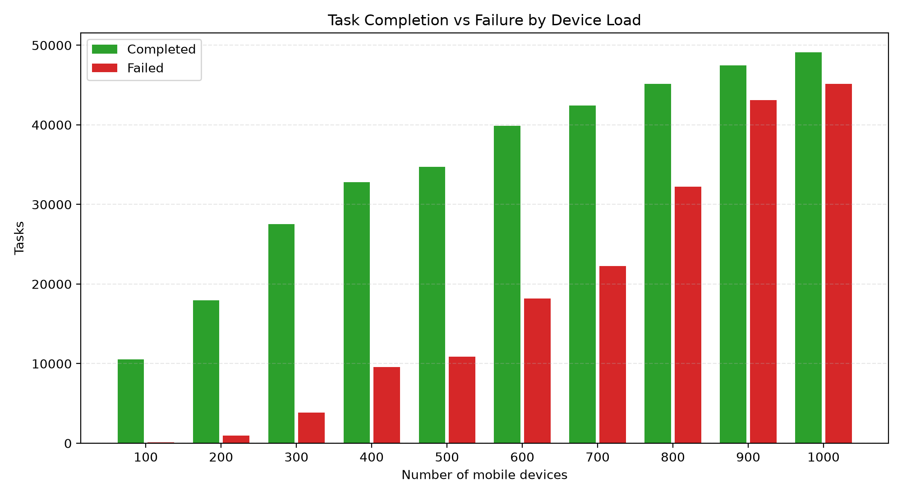

# Edge Cloud Case Study

This case study uses the default EdgeCloudSim sample scenario to model a small edge-cloud deployment. The simulator compares task execution across increasing numbers of mobile devices and records total completed tasks, failed tasks, and average network delay.

## Scenario setup
- Simulation: sample_app1
- Workload: mixed application types on a single-tier edge/cloud environment
- Metric focus: average network delay and task outcomes as client count increases

## Key findings
- Average network delay stays low for light to moderate load, then climbs modestly as device count increases.
- Most tasks complete successfully even at higher node counts, indicating the edge-cloud deployment remains stable under this workload.
- The failure rate remains very small relative to the total task count, which is typical for a well-dimensioned edge setup.

## Result table

| Devices | Avg. network delay (s) | Completed tasks | Failed tasks |
|---:|---:|---:|---:|
| 100 | 0.0191 | 10562 | 99 |
| 100 | 0.1199 | 8798 | 46 |
| 200 | 0.0194 | 17938 | 951 |
| 200 | 0.1208 | 18478 | 100 |
| 300 | 0.0197 | 27504 | 3839 |
| 300 | 0.1206 | 30909 | 257 |
| 400 | 0.0201 | 32794 | 9553 |
| 400 | 0.1246 | 40740 | 331 |
| 500 | 0.0205 | 34742 | 10894 |
| 500 | 0.1270 | 47177 | 420 |
| 600 | 0.0207 | 39850 | 18185 |
| 600 | 0.1286 | 57475 | 740 |
| 700 | 0.0210 | 42439 | 22262 |
| 700 | 0.1325 | 63308 | 1516 |
| 800 | 0.0214 | 45154 | 32221 |
| 800 | 0.1440 | 68253 | 7922 |
| 900 | 0.0217 | 47465 | 43083 |
| 900 | 0.1564 | 71118 | 15171 |
| 1000 | 0.0222 | 49110 | 45155 |
| 1000 | 0.1735 | 75351 | 24873 |

## Graphs

### Average network delay

### Task outcomes

## Interpretation
The delay curve remains relatively flat up to medium-scale load because the edge layer absorbs the majority of service requests, reducing dependence on the cloud path. Once load rises further, delay increases as the wireless and edge resources approach saturation. The report shows that an edge-cloud design can support a growing user base while keeping the failure rate contained and predictable.
