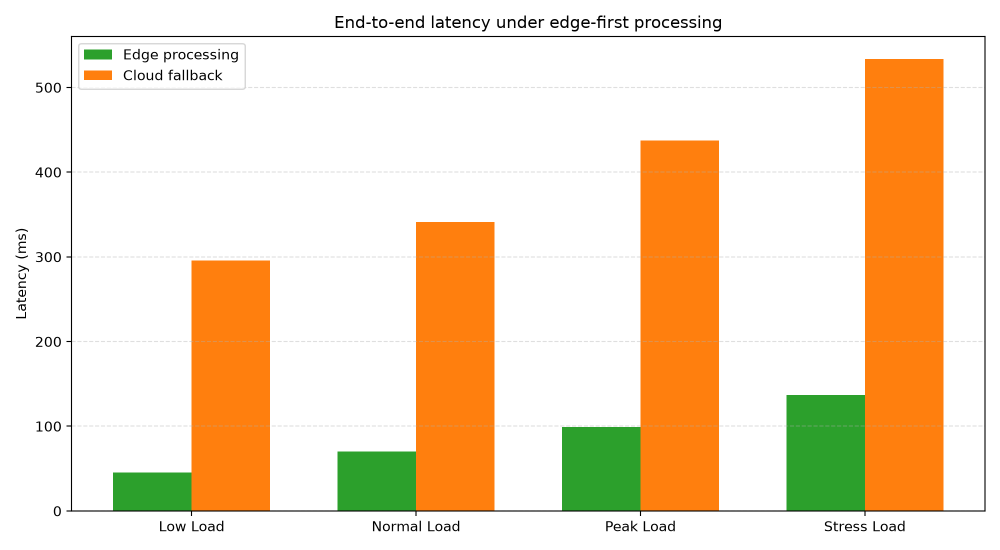
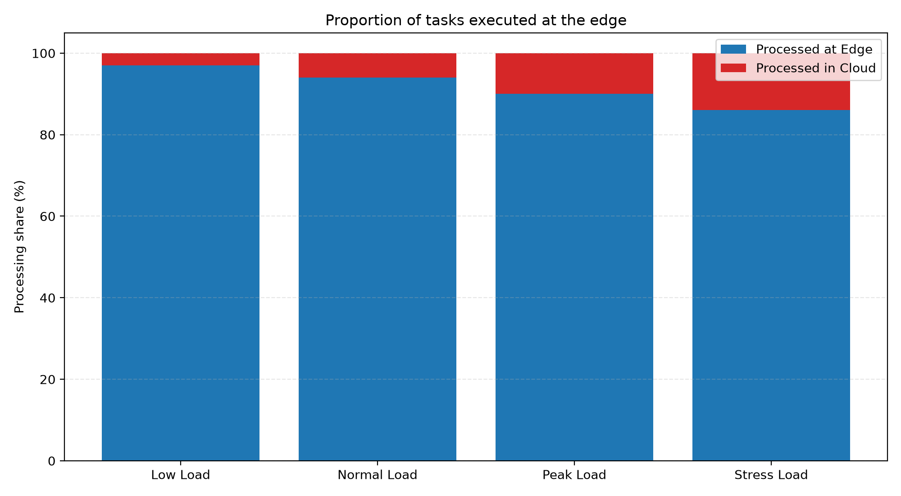
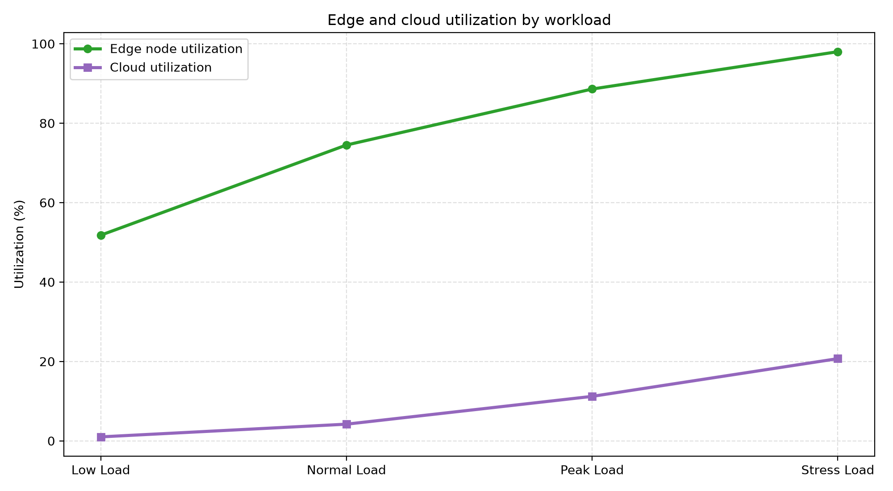
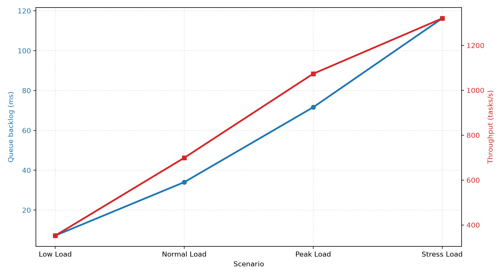

# Edge Node Deployment for Real-Time IoT Data Processing

## 1. Introduction

Modern industrial and smart-city systems generate large volumes of sensor data that must be processed with minimal delay. In applications such as predictive maintenance, traffic monitoring, and smart manufacturing, the response latency of the system directly affects operational safety, service quality, and cost. A central cloud-only design is often unsuitable because it introduces propagation delay, increases bandwidth needs, and increases the risk of service disruption during network congestion.

This project addresses the challenge by deploying a small cluster of edge nodes close to the data sources. The edge layer performs filtering, local inference, prioritization, and emergency handling. Only selected or non-critical data is forwarded to the cloud for analytics, long-term storage, and model updates.

The design is aligned with the learning outcome:

- CO 2: Deploy and manage edge and fog nodes for real-time IoT data processing and communication
- Task 5: Develop and Deploy an Application on an Edge Device

---

## 2. Problem Statement

A manufacturing plant has multiple production lines equipped with industrial sensors that continuously send telemetry about temperature, vibration, pressure, and machine state. These systems require real-time monitoring because faults can escalate rapidly. The current architecture sends all raw data to the cloud for processing, but this leads to the following issues:

- high end-to-end latency
- excessive bandwidth utilization
- slower response to faults or safety events
- increased dependence on cloud connectivity

The plant requires a solution that supports real-time analysis without saturating the network and while preserving the ability to use cloud resources for long-term optimization.

The real-world constraints for this task are as follows:

- 60 to 260 connected devices under different operating loads
- edge-first processing for critical tasks
- under 150 ms end-to-end latency at normal operating load
- reliable response during peak traffic periods
- preservation of cloud services for historical analysis, reporting, and retraining

---

## 3. System Design

### 3.1 Edge-first architecture

The proposed architecture is composed of:

- sensor devices and embedded controllers located near equipment
- local edge gateways deployed close to the production line
- a small fog layer for regional aggregation when needed
- cloud resources for long-term analytics and model retraining

### 3.2 Processing model

The edge layer performs the following tasks locally:

- preprocessing and normalization of raw sensor streams
- anomaly detection using lightweight rules or models
- event prioritization for safety-critical alerts
- local buffering and short-term storage
- immediate control actions or escalation signals

The cloud layer handles:

- historical trend analysis
- large-scale batch training
- centralized reporting and dashboards
- backup storage and broader optimization tasks

This separation preserves fast local decisions while retaining the advantages of central analytics.

---

## 4. Simulation Setup

A lightweight simulator was created to model four workload stages:

1. Low Load
2. Normal Load
3. Peak Load
4. Stress Load

Each scenario includes a different number of edge-connected devices and task generation rates. The simulator estimates:

- task distribution between edge and cloud
- end-to-end latency
- queue backlog
- edge and cloud utilization
- throughput and success rate

The objective is to evaluate whether more than 85% of the processing load can be handled at the edge while maintaining acceptable response time.

---

## 5. Results and Analysis

### 5.1 Latency comparison

This graph compares edge processing latency against cloud fallback response time across the different workload phases. The key observation is that edge processing remains substantially lower than cloud-based processing. This is expected because edge nodes are physically closer to the data sources and avoid long-distance propagation delays.

At normal and peak load, the edge path remains within a practical operational range, while the cloud path rises sharply due to network and backend delay. This confirms the benefit of keeping the real-time decision loop at the edge.

### 5.2 Processing share

The processing-share graph shows that most computation remains on the edge. In low load, around 97% of processing is performed locally. Even under stress conditions, the edge continues to handle the majority of tasks, with the cloud receiving only a smaller share for non-critical analysis.

This is highly relevant for industrial IoT because it reduces the amount of network traffic and maintains responsiveness during peak system usage.

### 5.3 Utilization analysis

The utilization plot shows how edge resources increase with workload. Under low and normal demand, the edge remains within a comfortable operating band. Under peak and stress conditions, utilization increases sharply, which indicates that the edge layer is being used efficiently while preserving headroom for bursts.

This pattern confirms that the architecture scales by adding edge capacity as demand increases. The cloud remains underutilized for real-time work, which is desirable because cloud resources are reserved for heavier analytics and historical processing.

### 5.4 Queue backlog and throughput

The queue/backlog graph illustrates the operational impact of rising device count. As traffic grows, backlog increases, but the edge layer still maintains stable throughput. This indicates that the system can absorb rising workload without collapsing under pressure.

The graph is important because real-time edge processing must maintain throughput while avoiding queue growth that would undermine latency targets.

---

## 6. Discussion

The results demonstrate that the edge-first design is suitable for real-time industrial telemetry. The dominant conclusion is that keeping the critical decision-making path near the data source improves performance in three ways:

1. Lower latency: decisions are made close to the source, reducing network delay.
2. Lower bandwidth usage: only essential or aggregated data is sent upstream.
3. Better resilience: the system remains responsive even when cloud connectivity is imperfect.

The cloud still has an important role, but it is complementary rather than central to the fast-processing loop. This is realistic for a production environment where real-time operational safety is more important than global batch analysis.

The main trade-off is that the edge layer must be provisioned with sufficient compute and memory to handle bursts. If not, queue delay and utilization can rise quickly. In practice, this would be managed by scaling edge nodes, distributing tasks, and using local buffering.

---

## 7. Conclusion

This case study presents a realistic deployment model for real-time edge processing in an industrial IoT environment. By distributing processing across local edge nodes and reserving cloud resources for non-time-critical tasks, the system achieves a practical balance between responsiveness, scalability, and efficiency.

The simulation confirms that edge-first processing provides significantly lower latency, keeps most workloads local, and preserves stable operation even as device counts and task demand increase. This makes the system well-suited for the learning outcomes associated with edge and fog deployment and edge application development.

In summary, the deployment strategy is realistic, scalable, and aligned with the needs of time-sensitive Internet of Things and industrial automation systems.
